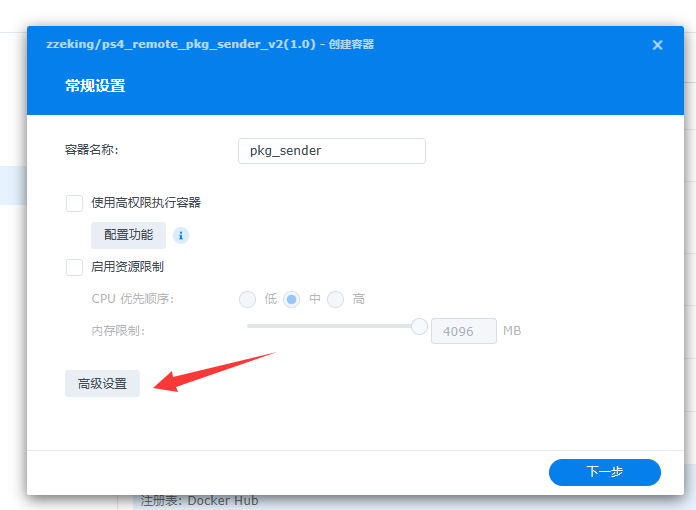
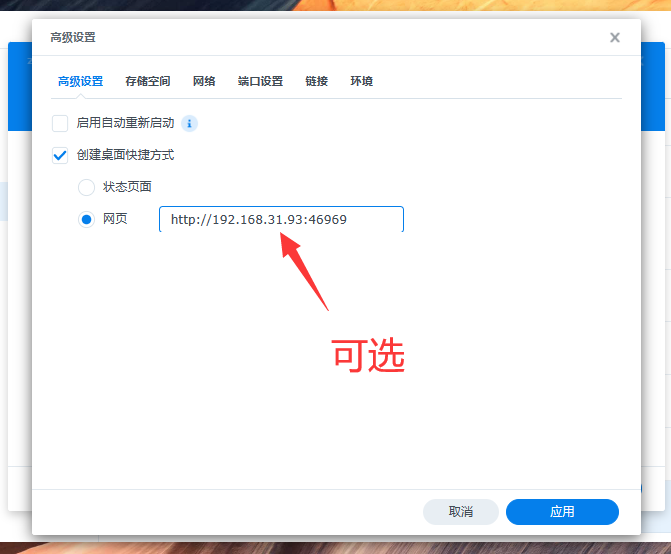
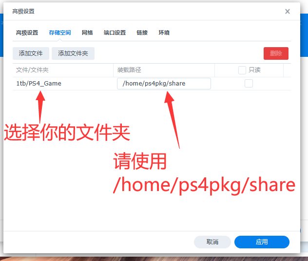
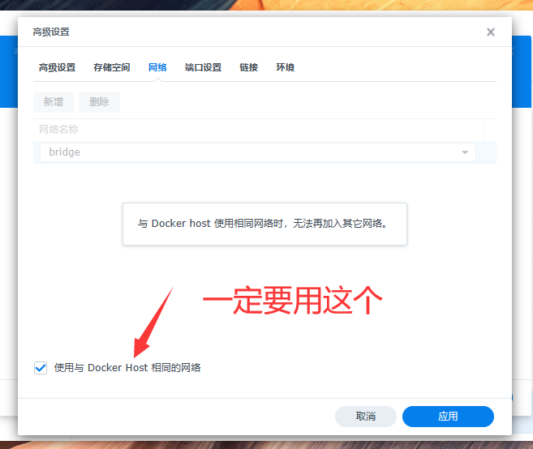
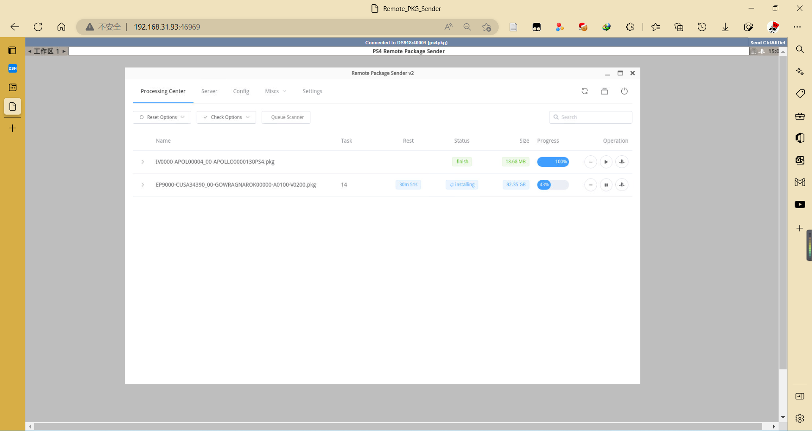

# PS4_Remote_PKG_Sender

dockerhub: 

## 简介

由于本人暂时没找到web版本或者灵活的linux版本pkg_sender，且群辉无gui等组件，本人技术菜写不出好的pkg_sender，所以我考虑到使用容器的方式部署PS4 Remote PKG Sender。基础镜像采用ubuntu:18.04，安装配置好桌面及vnc就可以正常达到我想要的效果，何乐而不为。

## 安装

### 以群晖（ssh）为例

切换到root用户

```
zzeking@DS918:/$ sudo -i
```


首先找到你的存储位置，一般为/volumx/name/，其中x表示你的存储池，name表示你的存储空间名称，如下所示：

```shell
root@DS918:/# ls
bin     dev  etc.defaults  lib    lib64       mnt  proc  run   syno_etcd_client:2379  tmp  var           volume1  volume3
config  etc  initrd        lib32  lost+found  opt  root  sbin  sys                    usr  var.defaults  volume2  volume4
root@DS918:/# cd volume3
root@DS918:/volume3# ls
1tb  @database  @eaDir  @iSCSI  @postgres.core.gz  @Repository  @S2S  @synopkgctl.core.gz  @systemd-shutdow.core.gz  @tmp  @userpreference  vdsm_repo.conf
root@DS918:/volume3# cd 1tb/
root@DS918:/volume3/1tb# ls
 BaiDuNetDisk   @eaDir   NS_Game   PS4_Game

```

切换到路径，然后运行即可：

```shell
root@DS918:~# cd /volume3/1tb/PS4_Game
root@DS918:~# docker run -d \
	--name=pkg_sender \
	--network=host \
	-v $PWD:/home/ps4pkg/share \
	zzeking/ps4_remote_pkg_sender_v2:1.0
```

**特别说明1：**由于网络及应用特殊性请使用host网络，不要使用桥接网络！！！

**特别说明2：**web端口为46969

### 以群晖（docker面板）为例









然后应用下一步启动就行

## 使用

浏览器打开 http://你群晖ip:46969 ,然后其他使用和原软件使用方式一样。



## 编译

```shell
chmod +x make.sh
./make
```

## 致谢

[Gkiokan/ps4-remote-pkg-sender (github.com)](https://github.com/Gkiokan/ps4-remote-pkg-sender)

[john-shine/Docker-CodeWeavers_CrossOver-VNC: A docker for run CrossOver though VNC remote manage (github.com)](https://github.com/john-shine/Docker-CodeWeavers_CrossOver-VNC/tree/master/BaiduNetdisk)
